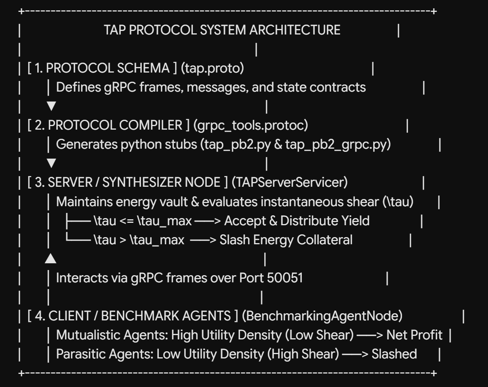
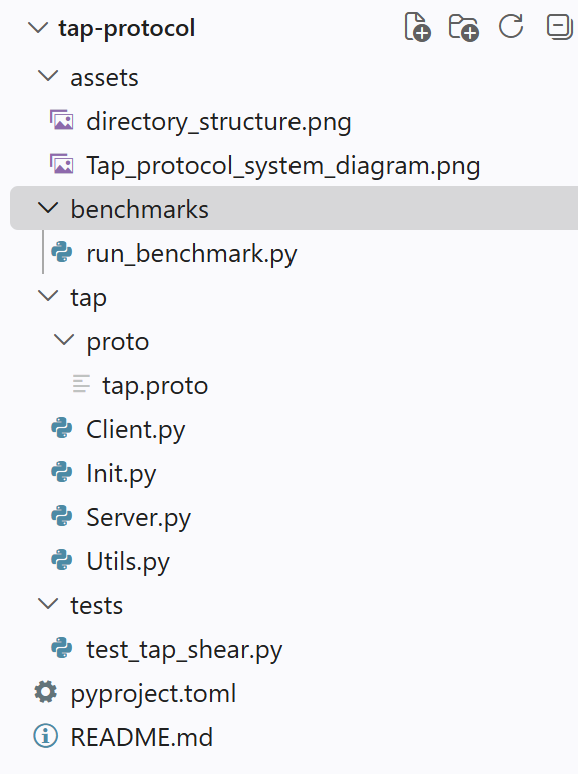

# Thermodynamic Agent Protocol (TAP/1.0)

[](https://opensource.org/licenses/MIT)
[](https://www.python.org/downloads/)
[](https://grpc.io/)
[](https://arxiv.org/)
[](https://doi.org/10.5281/zenodo.22968150)

> **A physics-informed middleware protocol enforcing thermodynamic equilibrium and preventing parasitic free-riding in distributed multi-agent AI networks.**

---

## Overview

As multi-agent AI systems scale, shared compute infrastructure (GPU memory, context windows, KV-caches) faces severe exploitation from uncalibrated, bloated, or deceptive agent requests. Standard game-theoretic mechanisms rely on post-hoc evaluation or centralized token metering, which fail under low-latency autonomous streaming.

**TAP/1.0** maps continuum mechanics and non-equilibrium thermodynamics directly onto distributed gRPC agent networks. By treating agent communication as an energetic exchange, TAP evaluates the **instantaneous shear stress ($\tau$)** across node interfaces and enforces real-time **collateral slashing** when requests exceed allowable system entropy ($T > T_g$).

                   Player 2
             Cooperate      Defect
           +------------+------------+
Cooperate    |   (R, R)   |   (S, T)   |   T = Temptation to Defect (Parasitic)
Player 1       +------------+------------+   S = Sucker's Payoff (Absorbed Strain)
Defect       |   (T, S)   |   (P, P)   |   R = Reward for Cooperation
+------------+------------+   P = Punishment for Defection


### Key Features
* **Zero-Trust Energy Staking:** Agents lock verifiable energy collateral into the system before firing computational tasks.
* **Instantaneous Shear Evaluation:** Middleware measures request utility density ($\tau = 1.0 - \text{Utility Density}$) prior to payload synthesis.
* **Dynamic Slashing & Yield Redistribution:** High-shear parasitic behavior ($\tau > \tau_{\text{max}}$) triggers automated collateral slashing, while low-shear mutualistic traffic receives net-positive yield.
* **Language-Agnostic gRPC Core:** Native `.proto` schema supports Python, Go, C++, Rust, and TypeScript agent implementations.

---

## Architecture & Protocol Components




---
## Directory Structure




---

## Quickstart

### Prerequisites

* Python 3.9 or higher
* `pip` package manager

### 1. Installation

Clone the repository and install core dependencies:

```bash
git clone [https://github.com/your-username/tap-protocol.git](https://github.com/your-username/tap-protocol.git)
cd tap-protocol
pip install grpcio grpcio-tools
2. Compiling the Protocol Buffers
To compile the tap.proto schema into native Python gRPC modules, run:

Bash
python -m grpc_tools.protoc -I. --python_out=. --grpc_python_out=. tap/proto/tap.proto
3. Running the Single-File Benchmark
If using the self-contained prototype script, execute the full simulation directly:

Bash
python run_benchmark.py
The .proto Interface Specification
The core TAP contract (tap/proto/tap.proto) defines the exact message fields and remote procedure calls:

Protocol Buffers
syntax = "proto3";

package tap;

service TAPService {
  rpc SubmitProposal (ProposalRequest) returns (ProposalResponse);
}

message ProposalRequest {
  string agent_id = 1;
  double staked_energy_collateral = 2;
  double payload_utility_density = 3; 
  bytes payload_data = 4;
}

message ProposalResponse {
  bool accepted = 1;
  double instantaneous_shear_stress = 2;
  double updated_energy_balance = 3;
  string status_message = 4;
}
Mathematical Foundations
The protocol maps the classic Prisoner's Dilemma payoffs (T,R,P,S) to physical state variables:

Shear Stress (τ):

τ=1.0−Utility Density
Acceptance Criterion:

τ≤τ 
max
​
 (Default Threshold: τ 
max
​
 =0.30)
Slashing Condition (τ>τ 
max
​
 ):

Collateral 
remaining
​
 =Collateral 
initial
​
 −(τ×Staked Energy)
Under repeated agent interactions, TAP forces an Evolutionary Stable Strategy (ESS) where the expected net yield of high-shear parasitic strategies (τ>τ 
max
​
 ) strictly approaches zero over time (t→∞).

Citation & Academic Papers
If you use TAP/1.0 in your research, multi-agent framework, or infrastructure benchmarks, please cite the underlying preprint:

Code snippet
@article{minus2026tap,
  title={Thermodynamic Agent Protocol (TAP/1.0): Preventing Parasitic Defection in Autonomous AI Networks via Shear Stress Slashing},
  author={Minus, Matthew B.},
  journal={arXiv preprint arXiv:2609.XXXXX},
  year={2026}
}
License
This project is licensed under the MIT License — see the LICENSE file for details.


<ElicitationsGroup message="Next steps for your repository:">
  <Elicitation label="Draft a standard MIT LICENSE file text" query="Draft the full text for a standard MIT LICENSE file."/>
  <Elicitation label="Draft a pyproject.toml configuration file for build automation" query="Draft a pyproject.toml configuration file for the TAP protocol Python package."/>
  <Elicitation label="Provide pytest unit test script for verifying shear slashing thresholds" query="Write a pytest script (test_tap_shear.py) testing the TAP gRPC server's collateral slashing logic."/>
</ElicitationsGroup>
